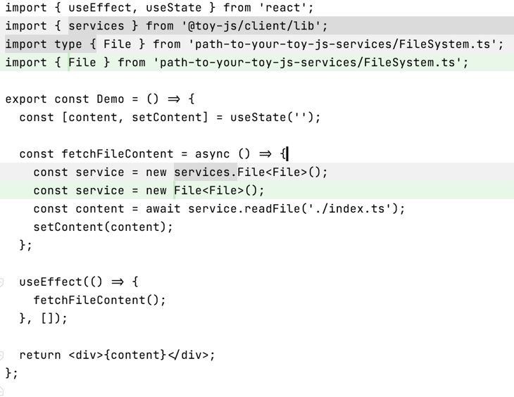

# `toy-js`

`toy-js`是一个极简的后端框架, 致力于使用语法糖消除后端接口调用的繁琐, 并零配置复用
接口调用的类型声明.

## 如何使用

### 编写服务器端代码:

```ts
import { Service } from '@toy-js/server';
import { promises as fs } from 'fs';

@Service()
class FileSystem {
  constructor() {}
  async readFile(path: string): Promise<string> {
    const buffer = fs.readFile(path);
    return buffer.toString();
  }
}
```

运行: `ts-node path-to-your-toy-js-services/FileSystem.ts`

命令行终端将会提示服务器已经启动.

如代码所示, 使用`toy-js`编写服务器端代码, 只需要将功能封装在一个类中, 然后通过`@Service`
进行装饰, 甚至不需要配置路由, 端口/host(支持自定义配置), 跨域(默认跨域, 支持配置), body 如何解析(支持配置).

### 前端调用

让我们先假设我们直接在`React`代码中直接调用`FileSystem`服务:

```tsx
import { useEffect, useState } from 'react';
import { File } from 'path-to-your-toy-js-services/FileSystem.ts';

export const Demo = () => {
  const [content, setContent] = useState('');

  const fetchFileContent = async () => {
    const service = new File<File>();
    const content = await service.readFile('./index.ts');
    setContent(content);
  };

  useEffect(() => {
    fetchFileContent();
  }, []);

  return <div>{content}</div>;
};
```

这当然是行不通的, 因为`File`服务是服务端代码(使用了`fs`模块), 不能直接在浏览器中运行.

然而通过`toy-js/client`提供的的客户端工具, 可以**模拟**(本质是语法糖)在浏览器端代码中
调用服务器端的服务, 就像调用一个普通的异步方法那么自然.

```tsx
import { useEffect, useState } from 'react';
import { services } from '@toy-js/client/lib';
import type { File } from 'path-to-your-toy-js-services/FileSystem.ts';

export const Demo = () => {
  const [content, setContent] = useState('');
  
  const fetchFileContent = async () => {
    const service = new services.File<File>();
    const content = await service.readFile('./index.ts');
    setContent(content);
  };
  
  useEffect(() => {
    fetchFileContent();
  }, []);
  return <div>{content}</div>;
};
```
代码差异如下图:


对比直接在`React`中把服务import进来调用的代码示例, 使用`@toy-js/client`的代码只是稍微修改下服务
的引用方式:

`const content = await service.readFile('./index.ts');`

改为`const service = new services.File<File>();`

使得代码*看起来*像是**可以在浏览器端代码直接调用服务器端代码**, 
并且零配置提供了服务器端的类型声明.

## 使用场景
`toy-js`正如其名, 适用于**个人小工具类型的服务器**开发, 比如:
> 我写了个电影爬虫, 需要写一个简单的本地服务器, 前端可以由此获取爬虫的结果, 展示爬取的电影海报
> 和下载链接.

那么, 恭喜你, `toy-js`可以让你用最小的开发成本搭建这个服务器, 你甚至不需要使用`axios`发起http
请求, 一切就像调用一个异步方法那么自然.


